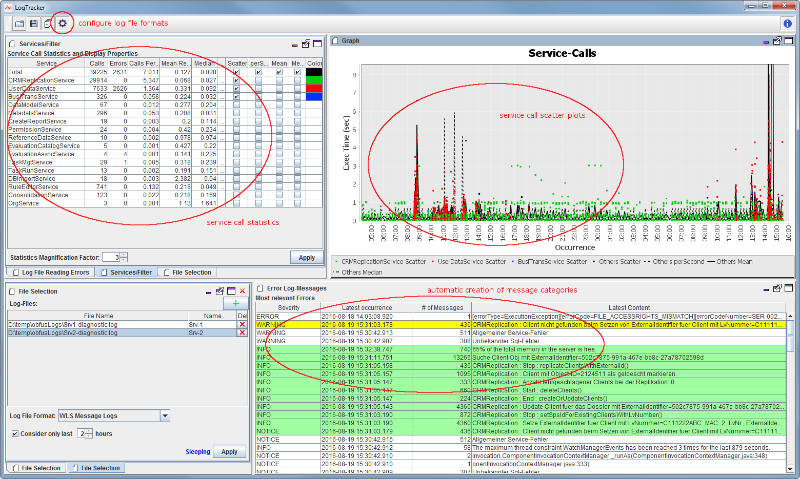

# Instant Log-Tracker

Instant Log-Tracker is an easy to use tool for ad-hoc log file analysis of application and system logs. It consists of a single executable (which requires a Java 8 runtime) and can be applied easily and straightforward as long as you have physical access to your log files.

Special features are:

* Log-File formats are configurable by the use of regex expression. Almost any log-file format, therefore can be monitored after having specified its format.
* Log-Files are constantly monitored. New data is processed immediately.
* All processing is done in memory. While this imposes some limits onto the amount of data that can be analyzed, it leads to highly efficient processing.

Instant Log-Tracker supports the following flavors of log files:

* __Service Call Statistics Files__ typically contain one or more lines per service call. The contain information about who called which service when and how long the server took to response. This file type may also contain a response code that indicates, if a service call was successful or not. Instant Log-Tracker calculates service call statistics and creates service scatter plots for the analysis of this type of data.
* __Message Logs__ typically contain messages about events that occurred within the server. They typically have an occurrence time stamp, a severity and a message text. Instant Log-Tracker uses some fuzzy logic to recognize "similar" messages and put them into the same categories. A special chart show the frequency of a certain type of messages.
* __Correlation Logs__ contain some additional information that is bound to a service call via a correlation-ID. Payload-Logs normally are of this type. Instant Log-Tracker allows the correlation of log entries that are spread over various files and file types by correlation-ID.

Copyright 2015,2016, Silvan Perego

Licensed under the Apache License, Version 2.0 (the "License")you may not use this file except in compliance with the License. You may obtain a copy of the License at

http://www.apache.org/licenses/LICENSE-2.0

Unless required by applicable law or agreed to in writing, software distributed under the License is distributed on an "AS IS" BASIS,WITHOUT WARRANTIES OR CONDITIONS OF ANY KIND, either express or implied.See the License for the specific language governing permissions and limitations under the License.

This program uses

JFreeChart from Object Refinery
Docking Frames
Launch4J
Axet Desktop

Requirements: LogTracker Requires Java 1.8 SE Runtime.